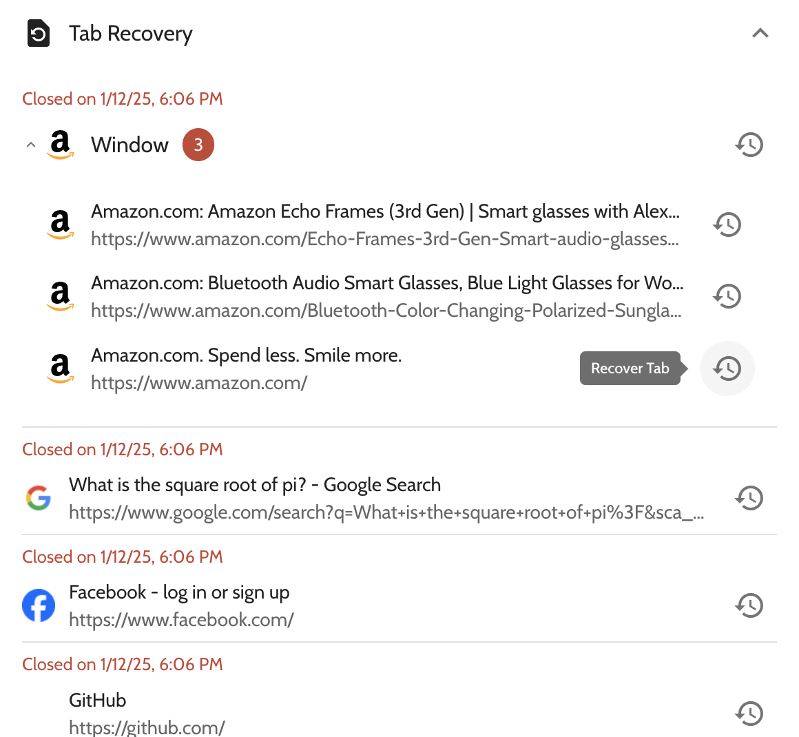

# Tab Samurai

  

Take your browsing experience to the next level with automatic tab hibernation, smart tab management, and intuitive tab recovery.

Install the extension for Chrome, Edge, Brave, and any other Chromium-based browsers [on the Chrome Webstore](https://chromewebstore.google.com/detail/tab-samurai/mbomhgfddnnehpokebhcgjgmmagkgemc).

## Features

Tab Samurai offers four primary features.

### Automatic tab hibernation, managed by you

- Boost browser performance by suspending tabs you haven't used in a while.
- Choose how long a tab should go un-viewed before hibernating.
- Manage which tabs should hibernate by curating a domain whitelist.

### Maximum visibility of every tab across all windows

- Search through all tabs with a single query.
- View your tabs grouped by window, or by domain.
- Quickly find tabs which are recording using your webcam/microphone, playing audio/video, or both.

### Fine-grained control of tabs, made simple

- Close an individual tab, or mass-close tabs under a certain domain.
- Mute an individual tab, or mass-mute all tabs in a window.
- Move all tabs under a certain domain to a new window.

### Intuitive lost tab recovery

- View recently closed tab & windows in a list.
- See the date & time for when a tab or window was closed.
- Recover a closed tab or window, or a specific tab in a closed window.

## License

Tab Samurai is an open-source project operating under a modified MIT license. [See license](./LICENSE)
